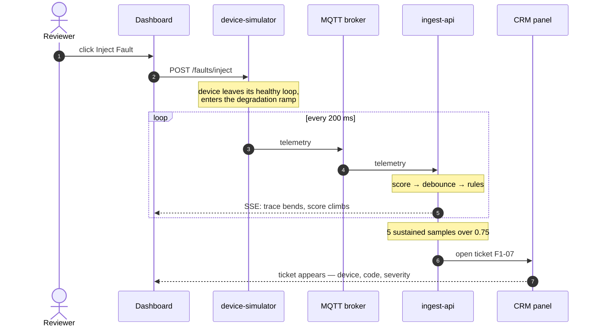
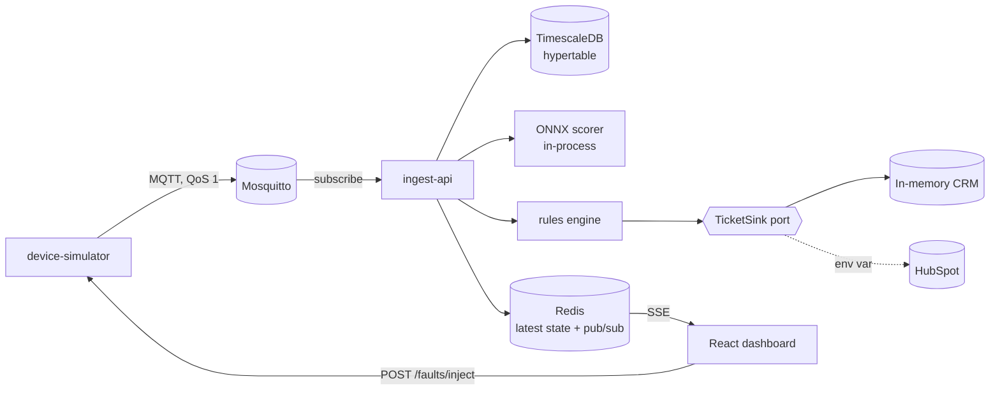

# airsense

**When a home air conditioner's compressor fails, the customer finds out first.**
The unit stops cooling on the hottest day of the year, they call support, and an
engineer visits twice — once to work out what broke, once to fix it. airsense
inverts that sequence. Connected units stream their own sensor readings
continuously, the system watches for the signature of a compressor degrading,
and it opens a support ticket with a diagnostic code already attached while the
unit is still cooling the room. The customer's first contact becomes an outbound
call offering a service visit, instead of an inbound complaint about a broken
appliance.

---

<!-- DEMO GIF GOES HERE — see docs/RECORDING.md -->
> **⚠ The demo recording is not in this repository yet.**
> It could not be produced on the machine this was built on: Docker was never
> installed there, so the full stack has never been started. Everything needed
> to record it is committed — [`docs/RECORDING.md`](docs/RECORDING.md) has the
> exact steps and the shot list. This placeholder stays until there is a real
> recording to replace it; a mocked-up screenshot would be worse than nothing.

---

## What you should see

One click, ten seconds, on one screen:



Measured worst case across the four demo devices: **7.6 seconds** from click to
ticket. A test enforces that budget against the real model and the shipped
thresholds — see [`test_acceptance.py`](apps/ingest-api/tests/integration/test_acceptance.py).

## Quickstart

Requires Docker with Compose v2.

```bash
cp .env.example .env && make up
```

| Service | URL |
| ------- | --- |
| dashboard | http://localhost:3000 |
| ingest-api | http://localhost:8000/docs |
| device-simulator | http://localhost:8001/docs |
| metrics | http://localhost:8000/metrics |

The replay fixture and the trained model are both committed, so there is no
download step and no training step. `make` is not available on Windows by
default; every target is a thin wrapper, so run the underlying command directly:

| Target | Equivalent |
| ------ | ---------- |
| `make up` | `docker compose up -d --build` |
| `make down` | `docker compose down` |
| `make logs` | `docker compose logs -f` |
| `make test` | `cd apps/ingest-api && pytest` |
| `make contracts` | `cd apps/ingest-api && lint-imports` |

No Docker at all? Open the repo in GitHub Codespaces — `.devcontainer/` brings
the stack up on their free quota. Replace `OWNER/REPO` with your fork:

```
[](https://codespaces.new/OWNER/REPO)
```

## Architecture



Five services plus a broker and two datastores, one compose file, one command.
[`docs/architecture.md`](docs/architecture.md) covers the wire format, the write
ordering, and the demo timing budget.

### The dependency rule

```
api  ──▶  infrastructure  ──▶  application  ──▶  domain
```

`domain` imports nothing from the other layers and no third-party framework —
not even Pydantic. It is plain stdlib, so the rules can be read and tested
without a running system. Three [import-linter](https://import-linter.readthedocs.io)
contracts enforce this in CI rather than leaving it to review:

```bash
cd apps/ingest-api && lint-imports
```

## The part worth reading

Most builds of this fire a ticket the instant a threshold is crossed. That is a
demo, not a system: it produces flapping states, duplicate tickets, severity
that means nothing, and a CRM full of churn for one broken compressor.

Four rules are the difference, and they carry **77 tests** between them:

1. **Hysteresis and debounce** — a transition needs five sustained samples, and
   entry/exit thresholds are separated by a deadband. Debounce alone is not
   enough: a score oscillating around one value satisfies a debounce window in
   *both* directions and flaps anyway. Twenty samples alternating either side of
   the threshold produce **zero** transitions.
2. **Ticket deduplication** — at most one open ticket per (device, fault class).
   Re-alerting escalates severity instead of filing again, and severity ratchets
   upward only: a technician dispatched against a HIGH ticket should not find it
   downgraded because the unit had a good hour.
3. **Severity mapping** — score band *and* rate of change, because a unit parked
   at 0.62 for a week and one that reached 0.62 this morning need different
   responses. Rate promotes; it never demotes.
4. **Cooldown** — a closed ticket cannot re-open for a quiet period, so a unit
   sitting on the threshold cannot fill the CRM with churn that looks like many
   faults instead of one unresolved one.

Each is a stdlib-only policy object in `domain/`, with its reasoning written
down in [`docs/domain-rules.md`](docs/domain-rules.md).

## Swapping the CRM

`TicketSink` is the ports-and-adapters point of this project.

`InMemoryTicketSink` backs the CRM panel the app serves itself, and the live
demo uses it **by design** — the one thing a reviewer is asked to watch cannot
break because someone else's API is having a bad afternoon.

`HubSpotTicketSink` talks to the real HubSpot Tickets API. Selecting it is one
environment variable:

```bash
TICKET_SINK=hubspot
HUBSPOT_ACCESS_TOKEN=pat-na1-…
```

No calling code changes. The application depends on the Protocol; only
`create_ticket_sink` knows which implementation exists.

## Design

Palette and typography were chosen with the `ui-ux-pro-max` skill rather than
left at the shadcn default.

**IBM Plex Sans + IBM Plex Mono** — Plex was commissioned for an industrial
engineering company, its mono cut supplies tabular figures so live sensor values
do not jitter as digits change, and IBM Plex Sans JP exists should this ever
need a Japanese-language build.

**Control-room palette** — a cool near-black (`#0B0F14`) with three raised
surface steps, rather than stock shadcn slate. Device condition uses teal /
amber / red-orange, which stay distinguishable under the common forms of colour
blindness, and every state is rendered with an icon and a label, never colour
alone. All fourteen foreground/background pairs clear WCAG AA; most clear AAA.
Inject Fault is amber rather than red on purpose: ALERT is red, and the control
that *causes* an alert must not look like the alert itself.

## Repository layout

```
apps/ingest-api/        FastAPI. domain / application / infrastructure / api
apps/device-simulator/  replays a dataset to MQTT, injects faults on demand
apps/dashboard/         React + TypeScript + Vite operator console
ml/                     training, evaluation, ONNX export, committed artifacts
infra/                  broker and database configuration
deploy/                 Oracle Always Free runbook, Caddy, Vercel notes
docs/                   architecture, the four rules, recording guide
```

---

# Limitations and Honest Scope

Read this section before you believe anything above it.

## The data is not air conditioner data

Training and replay both use **NASA C-MAPSS FD001** — the Commercial Modular
Aero-Propulsion System Simulation, published by the NASA Prognostics Center of
Excellence. It is **simulated run-to-failure data from a turbofan jet engine**.
Not an air conditioner. Not a compressor. Not real equipment of any kind — the
engine itself is a simulation.

Four of the five sensor channels are affine rescalings of C-MAPSS sensors into
physically plausible ranges for a ~3.5 kW residential split unit:

| AC channel | C-MAPSS source | Why the analogy holds |
| ---------- | -------------- | --------------------- |
| compressor current | `s11` static pressure, HPC outlet | rises with wear → a compressor working harder against fouling |
| discharge pressure | `s7` total pressure, HPC outlet | falls with wear → a compressor losing head as valves and rings wear |
| suction temperature | `s2` LPC outlet temperature | rises slightly → suction line warming as capacity is lost |
| vibration RMS | `s4` LPT outlet temperature | **the weakest analogy of the five** — a monotone thermal channel standing in for a mechanical one |
| ambient temperature | *synthesized* | genuinely independent of compressor health, so borrowing a degrading channel would fabricate a correlation |

The mapping preserves *degradation dynamics* — monotone drift, unit-to-unit
variation, realistic sensor noise — with units a domain expert would recognise.
It does not make this appliance telemetry. **This is a domain mapping, not
proprietary manufacturer data**, and nothing here came from any appliance
company.

The vibration channel deserves the loudest caveat. A real compressor's vibration
signature carries information about *which* component is failing, at frequencies
this data does not contain. A model trained on it would learn nothing about
bearing versus valve failure.

## What the model does and does not predict

It predicts a **health index in [0, 1]** — 0.0 while a unit looks healthy,
ramping to 1.0 at the modelled point of failure, flat at zero until the unit is
within a knee of failure.

It does **not** predict:

- remaining useful life in hours, days, or any wall-clock unit
- *which* component will fail, or a failure mode
- anything about a specific real air conditioner
- anything at all outside the C-MAPSS distribution it was trained on

Held-out performance (split by **unit**, never by row, because consecutive rows
share a rolling window and are near-duplicates): **R² 0.79, RMSE 0.153**. At a
0.5 threshold it flagged all 20 held-out units with a median 21 samples of
warning. Full numbers in [`ml/artifacts/model_card.md`](ml/artifacts/model_card.md).

One fault class exists — `COMPRESSOR_DEGRADATION`, diagnostic code `F1-07`. The
code is illustrative and is not any manufacturer's real service code. The
deduplication key is `(device, fault class)` so the structure supports more, but
today there is exactly one.

The demo fleet is **four devices**. Nothing here has been run at fleet scale.

## What has never been run

Stated plainly, because "it builds" and "it works" are different claims:

- **The full stack has never started.** Docker was not installed on the build
  machine. `docker compose up`, the Caddy config, the production overlay, and
  all three database migrations are written and unexecuted. The
  `create_hypertable` call in migration 0001 is the single most likely thing to
  fail on a first run.
- **No deployment has happened.** The Oracle runbook is written from the
  documented behaviour of the tools, not from having done it.
- **`HubSpotTicketSink` has never made a live call.** It is covered by contract
  tests against a mocked transport, which prove it builds the requests HubSpot
  documents — not that HubSpot accepts them.
- **MQTT, Redis pub/sub and SSE have never moved a byte over a real
  connection.** The tests cover the seams on either side, not the wire.

What *has* been verified, on every commit: 159 tests in the ingest service
including the four rules and real ONNX inference against the committed model,
three import-linter contracts, ruff, and a type check. The acceptance test
replays the real fixture through the real model into a real ticket sink —
in-process, so it proves the logic and the timing but not the transport.

## What production would actually need

- **A separate model service.** Scoring runs in-process because that is the
  right MVP answer, not the right production answer. Today a new model needs an
  API redeploy, scoring competes with ingest for the same event loop, and the
  per-device feature window lives in process memory — so a restart loses it and
  a second replica would start cold and disagree with the first until both
  warmed up.
- **Device authentication.** The broker allows anonymous connections. Real units
  need per-device X.509 client certificates and a revocation story; right now
  anything that can reach the broker can impersonate any unit.
- **Backpressure.** Ingest writes to the database synchronously per message. A
  fleet of any size needs a bounded queue and a considered drop policy — at
  present a slow database becomes an unbounded memory problem.
- **Multi-tenancy.** No concept of an owner, an installer, or a service region.
  Device IDs are global and every ticket goes to one pipeline.
- **Model drift monitoring.** Nothing watches whether live feature distributions
  still resemble the training set. For a model trained on mapped turbofan data,
  this is not a nicety — it is the mechanism by which you would find out the
  model had stopped meaning anything.
- **Ticket lifecycle beyond opening.** Tickets resolve when a device returns to
  NORMAL. There is no assignment, no SLA, no escalation to a human, and no
  feedback loop from "engineer visited and found nothing" back into the model.

## Deliberate non-goals

Authentication and user management, a mobile app, Kubernetes manifests, energy
analytics, a second product line. Each is a plausible extension; each would have
diluted the one flow this repository exists to demonstrate.
