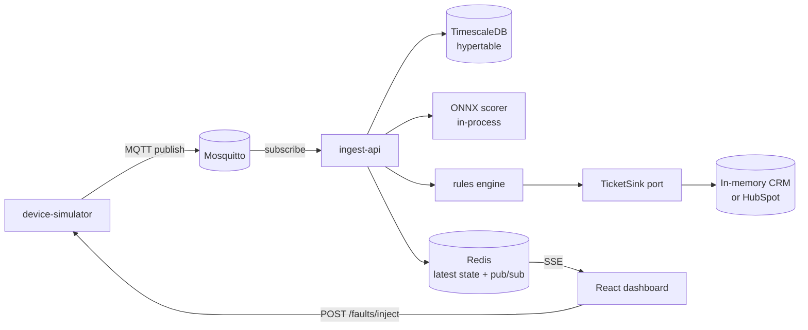

# Architecture

## Runtime shape



## Dependency rule

One direction only:

```
api  ──▶  infrastructure  ──▶  application  ──▶  domain
```

- `domain` imports nothing from the other three, and no third-party framework —
  not even Pydantic. Plain stdlib.
- `application` declares outbound needs as `typing.Protocol` ports.
- `infrastructure` implements those ports.
- `api` is the composition root: it picks concrete adapters and wires them.

This is enforced by two import-linter contracts in
`apps/ingest-api/pyproject.toml` and checked in CI, not left to review.

## The telemetry path

One MQTT topic per device (`airsense/telemetry/AC-0001`), QoS 1. Ingest is
idempotent on `(recorded_at, device_id)` via an upsert, so at-least-once
delivery and a device replaying its last frame after reconnect are both
absorbed rather than erroring.

`TelemetryMessage` in `infrastructure/wire.py` is the single wire shape: MQTT
payloads, Redis pub/sub frames and SSE events all use it, so there is one parser
and one serializer instead of three that drift. It rejects unknown fields, and
conversion to the domain type applies the physical envelope in
`domain/telemetry.py` — a value outside it is a sensor or transport fault, not a
reading, and is counted in `airsense_readings_rejected_total`.

Writes are ordered persist → cache → publish. History is the only durable
record, so a dashboard that misses a frame recovers on the next one, whereas a
reading dropped before persistence is gone.

## Scoring

The feature vector is defined in `domain/features.py`, not in the model code:
*what characterises degradation* is a domain decision. Offline training builds
the same twenty-value vector from the same definition, and `feature_spec.json`
is committed alongside the model so a test on each side fails if the two ever
drift.

Scores are `float | None`. A device that has not yet reported a full window is
stored unscored — `0.0` would be indistinguishable from a genuinely healthy
unit, and P3's rules would act on it.

## Why scoring is in-process

A separate model-serving service is the correct production answer and the wrong
MVP answer. In-process ONNX keeps the scoring hop out of the critical path and
removes a service from the demo's failure surface. The cost — you cannot deploy
a new model without redeploying the API, and scoring competes with ingest for
the same event loop — is listed in the README's Limitations section.

## Phase status

| Phase | Scope | State |
| ----- | ----- | ----- |
| P0 | skeleton, compose, CI, health, import-linter | done |
| P1 | simulator → MQTT → ingest → Timescale → SSE → chart | done |
| P2 | offline training, ONNX export, in-process scoring | done |
| P3 | four domain rules, TicketSink, CRM panel | pending |
| P4 | HubSpot adapter, Inject Fault, deploy | pending |
| P5 | README, diagram, video, Limitations | pending |
