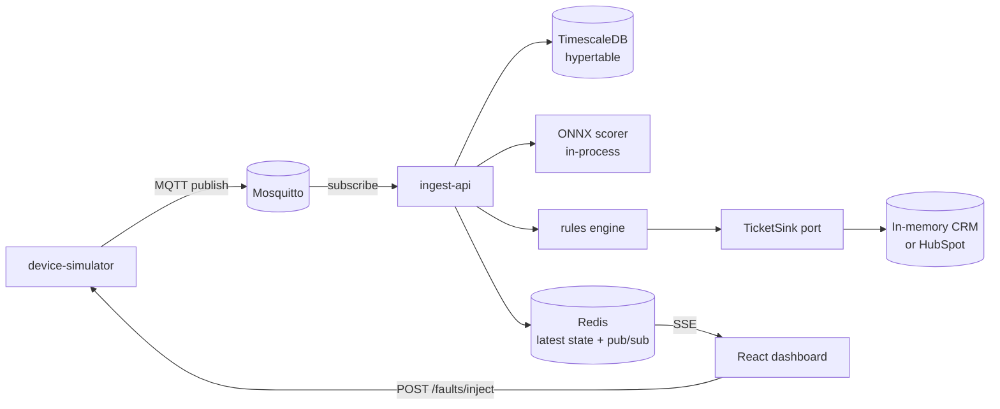

# Architecture

## Runtime shape



## Dependency rule

One direction only:

```
api  ──▶  infrastructure  ──▶  application  ──▶  domain
```

- `domain` imports nothing from the other three, and no third-party framework —
  not even Pydantic. Plain stdlib.
- `application` declares outbound needs as `typing.Protocol` ports.
- `infrastructure` implements those ports.
- `api` is the composition root: it picks concrete adapters and wires them.

This is enforced by two import-linter contracts in
`apps/ingest-api/pyproject.toml` and checked in CI, not left to review.

## Why scoring is in-process

A separate model-serving service is the correct production answer and the wrong
MVP answer. In-process ONNX keeps the scoring hop out of the critical path and
removes a service from the demo's failure surface. The cost — you cannot deploy
a new model without redeploying the API, and scoring competes with ingest for
the same event loop — is listed in the README's Limitations section.

## Phase status

| Phase | Scope | State |
| ----- | ----- | ----- |
| P0 | skeleton, compose, CI, health, import-linter | done |
| P1 | simulator → MQTT → ingest → Timescale → SSE → chart | pending |
| P2 | offline training, ONNX export, in-process scoring | pending |
| P3 | four domain rules, TicketSink, CRM panel | pending |
| P4 | HubSpot adapter, Inject Fault, deploy | pending |
| P5 | README, diagram, video, Limitations | pending |
